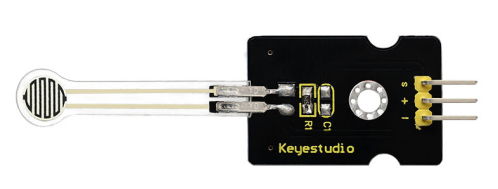
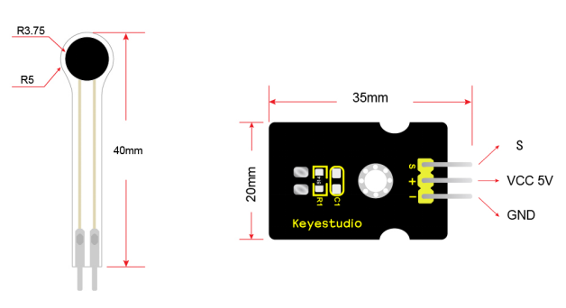
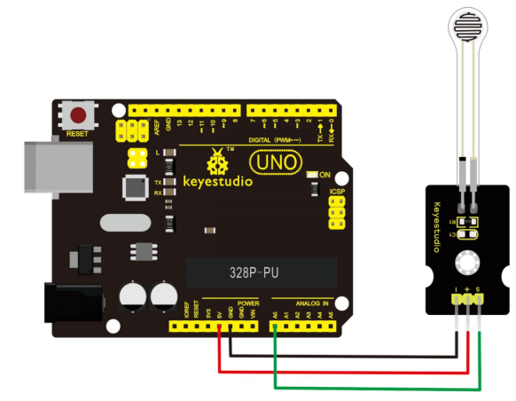
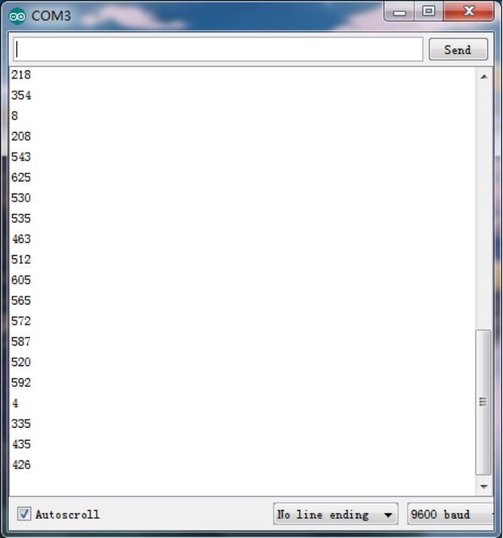

# KS0309 Keyestudio Thin-film Pressure Sensor (Black and Eco-friendly)



## 1. Description

This sensor adopts the flexible nano pressure-sensitive material with an ultra-thin film pad. It has the functions of water-proof and pressure detection.

When the sensor detects the outside pressure, the resistance of sensor will make a change. So we can use the circuit to convert the pressure signal that senses pressure change into the corresponding electric signal output. In this way, we can know the conditions of pressure changes by detecting the signal changes.

## 2. Dimensions



## 3. Parameters

- Working Voltage：DC 3.3V—5V
- Range：0-0.5KG
- Thickness：＜0.25mm
- Response Point：＜20g
- Repeatability：＜±5.8%（50% load）
- Accuracy：±2.5%（85% range interval）
- Durability：＞100 thousand times
- Initial Resistance：＞100MΩ (no load)
- Response Time：＜1ms
- Recovery Time：＜15ms
- Working Temperature：﹣20℃ to 60℃

## 4. Connection Diagram

You can refer to the following connection. For UNO board and pressure sensor, connect the S pin of sensor to A0, negative pin to GND, positive pin to 5V.



## 5. Sample Code

Download code: [Code](./Code.7z)

Wire it up well, please upload the below code to Arduino IDE.

```c
int s_pin = A0;
void setup()
{
  Serial.begin(9600);
  pinMode(s_pin,INPUT);

}

void loop() 
{
  Serial.println(analogRead(s_pin));
  delay(500);
}
```

## 6. Test Result

Done uploading the above code, open the serial monitor on Arduino IDE. Then, press the sensor with your hand, the value shown on the monitor is increasing. So this sensor works normally.

